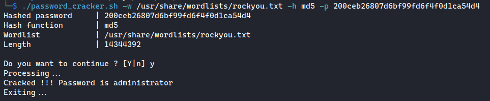

# Password cracker

With this script, you can provide a hashed password, the hash function that was used for this password and a wordlist. 
Then, the script will try to brutforce the password with the provided wordlist.

# Documentation

## Prerequisites

You need to have openssl installed on your PC.

## Supported hash functions

- MD5
- SHA1
- SHA256

## How to use it ?

Give the program the execution right :
```bash
chmod +x ./password_cracker.sh
```

Then, there are three options to pass to the script :
- **-w** for the wordlist
- **-h** for the hash function
- **-p** for the hashed password

### Example :

```bash
./password_cracker.sh -w /usr/share/wordlists/rockyou.txt -h md5 -p 200ceb26807d6bf99fd6f4f0d1ca54d4
```

Output :
 
